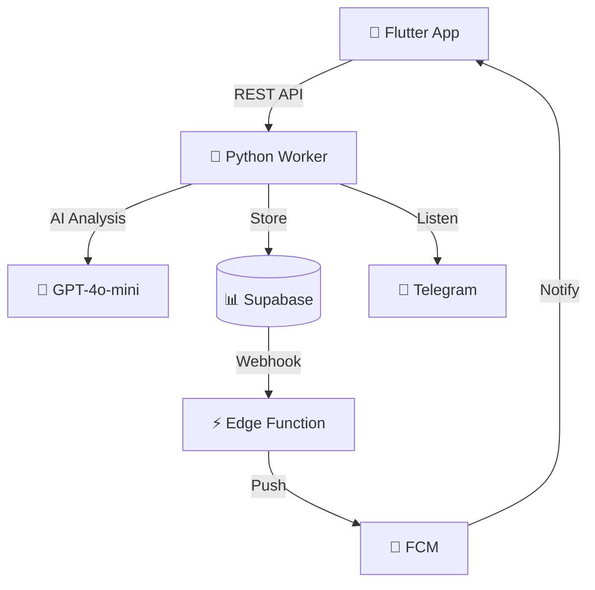

<div align="center">

# 🎯 Recall

### AI-Powered Task Reminder System

*Автоматическое извлечение задач из Telegram с помощью искусственного интеллекта*

[](https://www.python.org/)
[](https://flutter.dev/)
[](https://supabase.com/)
[](LICENSE)

[Особенности](#-особенности) • [Архитектура](#-архитектура) • [Установка](#-быстрый-старт) • [Документация](#-документация)

</div>

---

## ✨ Особенности

<table>
<tr>
<td width="50%">

### 🤖 AI-анализ сообщений
- Автоматическое извлечение задач
- Определение приоритета (urgent/high/medium/low)
- Парсинг дедлайнов ("завтра в 5", "через 2 часа")
- Обнаружение дубликатов

</td>
<td width="50%">

### 📱 Мобильное приложение
- Flutter для iOS и Android
- Real-time синхронизация
- Push-уведомления
- Красивый Material Design UI

</td>
</tr>
<tr>
<td width="50%">

### 🔐 Безопасность
- Шифрование Telegram сессий
- Row Level Security (RLS)
- Каждый видит только свои данные
- Безопасное хранение ключей

</td>
<td width="50%">

### ⚡ Производительность
- Обработка за 3-5 секунд
- Поддержка до 1000 пользователей
- Real-time обновления
- Оптимизированные запросы

</td>
</tr>
</table>

---

## 🏗️ Архитектура



### 💻 Стек технологий

<details>
<summary><b>Backend</b></summary>

- **Python 3.10+** - Основной язык
- **Pyrogram 2.0** - Telegram UserBot (MTProto)
- **FastAPI** - REST API сервер
- **Supabase** - База данных + Auth
- **OpenAI/Anthropic** - AI модели

</details>

<details>
<summary><b>Frontend</b></summary>

- **Flutter 3.0+** - Cross-platform UI
- **Riverpod** - State management
- **Supabase Flutter** - Real-time DB
- **Dio** - HTTP клиент

</details>

<details>
<summary><b>Infrastructure</b></summary>

- **Supabase Edge Functions** - Serverless (Deno)
- **Firebase Cloud Messaging** - Push notifications
- **Docker** - Containerization
- **PostgreSQL** - Database

</details>

---

## 🚀 Быстрый старт

### Требования

```bash
✅ Python 3.10+
✅ Flutter 3.0+
✅ Supabase аккаунт
✅ Telegram API credentials
```

### 📦 Шаг 1: Клонирование

```bash
git clone https://github.com/yourusername/recall-project.git
cd recall-project
```

### 🗄️ Шаг 2: Настройка базы данных

1. Создайте проект на [supabase.com](https://supabase.com)
2. Откройте **SQL Editor**
3. Выполните SQL из `supabase/migrations/001_initial_schema_fixed.sql`
4. Скопируйте `Project URL` и `service_role_key`

<details>
<summary>💡 Альтернатива: Supabase CLI</summary>

```bash
cd supabase
supabase login
supabase link --project-ref your-project-ref
supabase db push
```

</details>

### 🔑 Шаг 3: Telegram API

1. Зайдите на [my.telegram.org](https://my.telegram.org)
2. **API development tools** → Create application
3. Скопируйте `api_id` и `api_hash`

### ⚙️ Шаг 4: Настройка Worker

```bash
cd backend-worker

# Установка зависимостей
pip install -r requirements.txt

# Копирование конфига
cp config/config.example.yaml config/config.yaml

# Редактирование config.yaml
nano config/config.yaml
```

**Заполните `config/config.yaml`:**

```yaml
supabase:
  url: "https://YOUR-PROJECT.supabase.co"
  service_role_key: "YOUR_SERVICE_ROLE_KEY"

telegram:
  api_id: 12345678  # Ваш api_id
  api_hash: "YOUR_API_HASH"
  session_encryption_key: "GENERATE_KEY"  # См. ниже

ai:
  provider: "openai"
  model: "gpt-4o-mini"
  api_key: "YOUR_OPENAI_KEY"
  base_url: "https://api.openai.com/v1"  # Или GPT Lama
```

<details>
<summary>🔐 Генерация session_encryption_key</summary>

```bash
python -c "from cryptography.fernet import Fernet; print(Fernet.generate_key().decode())"
```

</details>

### ▶️ Шаг 5: Запуск

```bash
# Запуск Worker (основной процесс)
python src/worker.py

# В отдельном терминале: API Server
python src/api_server.py
```

API будет доступен на: `http://localhost:8000/docs` 📖

### 📱 Шаг 6: Flutter приложение

```bash
cd flutter-app

# Установка зависимостей
flutter pub get

# Настройка API endpoint
# Отредактируйте lib/core/constants/api_constants.dart

# Запуск
flutter run
```

---

## 🎯 Как это работает

### 📋 4-этапный AI Pipeline

```
1️⃣ EXTRACTOR          2️⃣ DEDUPLICATOR       3️⃣ DEADLINE PARSER    4️⃣ PRIORITIZER
   ↓                      ↓                      ↓                      ↓
Находит задачи      Проверяет дубли       Парсит дедлайны       Назначает приоритет
в сообщении         (схожесть >85%)       ("завтра в 5")        (urgent/high/med/low)
```

### 💬 Пример работы

**Входное сообщение:**
> "Привет! Можешь срочно отправить мне отчет? Клиент ждет!"

**AI анализ:**

```json
{
  "task": "Отправить отчет",
  "priority": "urgent",
  "deadline": "2024-12-06T16:00:00",
  "confidence": 0.95,
  "reasoning": "Ключевое слово 'срочно' + упоминание клиента"
}
```

**Результат:** 🔴 Задача создана с приоритетом URGENT, push-уведомление отправлено ✅

---

## 📚 Документация

### 📖 Основные гайды

- [📐 Архитектура системы](docs/SYSTEM_DESIGN.md) - Детальный дизайн
- [🔌 API примеры](docs/API_EXAMPLES.md) - REST API endpoints
- [📱 Flutter архитектура](flutter-app/ARCHITECTURE.md) - Структура приложения

### 🛠️ Разработка

<details>
<summary><b>Структура проекта</b></summary>

```
recall-project/
├── backend-worker/          # Python Worker + API
│   ├── src/
│   │   ├── worker.py        # Главный процесс
│   │   ├── ai_pipeline.py   # 4-этапный AI Pipeline
│   │   ├── api_server.py    # FastAPI сервер
│   │   ├── database.py      # Supabase клиент
│   │   └── prompts.py       # AI промпты
│   ├── config/
│   │   └── config.yaml      # Конфигурация
│   └── tests/               # Тесты
│
├── flutter-app/             # Мобильное приложение
│   ├── lib/
│   │   ├── data/            # Модели, сервисы
│   │   └── presentation/    # UI, providers
│   └── pubspec.yaml
│
├── supabase/
│   ├── migrations/          # SQL миграции
│   └── functions/           # Edge Functions
│
└── docs/                    # Документация
```

</details>

<details>
<summary><b>Тестирование</b></summary>

```bash
# Python тесты
cd backend-worker
pytest tests/

# Проверка подключений
python tests/test_supabase_connection.py
python tests/test_gptlama_api.py
```

</details>

---

## 🔧 Production Deployment

### 🐳 Docker

```bash
cd backend-worker
docker-compose up -d
```

### 📱 Сборка APK/IPA

```bash
# Android
flutter build apk --release

# iOS
flutter build ipa --release
```

### 📊 Мониторинг

- **Логи:** `logs/recall_worker.log`
- **Метрики:** Prometheus + Grafana
- **Алерты:** Edge Function logs

---

## 🔐 Безопасность

### ✅ Реализовано

- ✅ Шифрование Pyrogram сессий (Fernet/AES-128)
- ✅ Row Level Security в PostgreSQL
- ✅ Service Role изоляция для backend
- ✅ HTTPS для всех API запросов
- ✅ Валидация на уровне БД (CHECK constraints)

### 🛡️ Рекомендации

- 🔒 Используйте переменные окружения для ключей
- 🚦 Настройте rate limiting в FastAPI
- 🔑 Включите 2FA для Supabase Dashboard
- 🌐 Ограничьте CORS только вашими доменами
- 📝 Регулярный backup базы данных

---

## ❓ Troubleshooting

<details>
<summary><b>Worker не получает сообщения</b></summary>

**Решение:**
1. Проверьте `monitored_chats` в БД
2. Логи: `tail -f logs/recall_worker.log`
3. Убедитесь, что Pyrogram сессия активна
4. Проверьте `api_id` и `api_hash` в config.yaml

</details>

<details>
<summary><b>Push-уведомления не приходят</b></summary>

**Решение:**
1. Проверьте FCM token в таблице `profiles`
2. Логи Edge Function: `supabase functions logs send-task-notification`
3. Проверьте Database Webhook активен
4. Тестируйте FCM через Firebase Console

</details>

<details>
<summary><b>AI возвращает неправильные результаты</b></summary>

**Решение:**
1. Используйте более точную модель (`gpt-4`)
2. Настройте `min_confidence_threshold` в config
3. Обновите промпты в `src/prompts.py`
4. Включите DEBUG логи: `log_level: DEBUG`

</details>

---

## 🗺️ Roadmap

- [ ] 🌐 Web-версия на Next.js
- [ ] 📞 Поддержка WhatsApp (Baileys)
- [ ] 🎙️ Голосовые сообщения (Speech-to-Text)
- [ ] 📅 Интеграция с Google Calendar / Outlook
- [ ] 👥 Командная работа (shared tasks)
- [ ] 📊 Аналитика продуктивности
- [ ] 🔍 Semantic search по задачам
- [ ] 📸 OCR для изображений со скриншотами

---

## 📊 Статистика проекта

```
Backend Python:    ~2,650 строк кода
Flutter App:       ~1,800 строк кода
SQL миграции:      ~400 строк
Edge Functions:    ~300 строк
Документация:      ~3,000 строк

Итого:             ~8,150 строк кода
```

---

## 🤝 Вклад в проект

Contributions приветствуются! 🎉

1. Fork проекта
2. Создайте feature branch (`git checkout -b feature/AmazingFeature`)
3. Commit изменения (`git commit -m 'Add some AmazingFeature'`)
4. Push в branch (`git push origin feature/AmazingFeature`)
5. Откройте Pull Request

---

## 📄 Лицензия

Этот проект лицензирован под [MIT License](LICENSE).

---

## 💙 Благодарности

Огромная благодарность создателям этих замечательных технологий:

- [Pyrogram](https://docs.pyrogram.org) - Elegant MTProto API framework
- [Supabase](https://supabase.com) - Open source Firebase alternative
- [OpenAI](https://openai.com) - Powerful AI models
- [Flutter](https://flutter.dev) - Beautiful cross-platform framework
- [FastAPI](https://fastapi.tiangolo.com) - Modern Python web framework

---

<div align="center">

### 🌟 Если проект понравился - поставьте звезду! 🌟

**Made with ❤️ and ☕**

[⬆ Вернуться к началу](#-recall)

</div>
